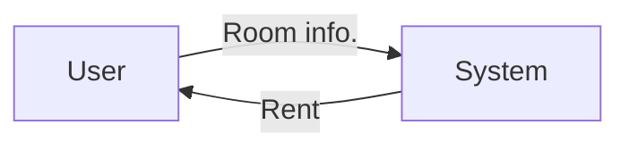
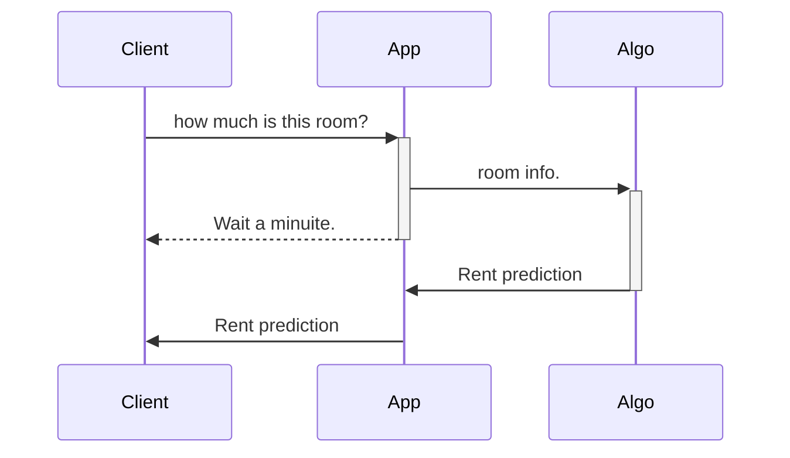
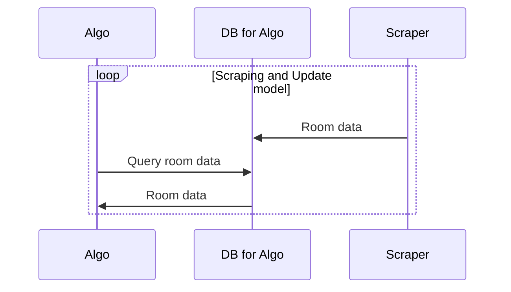

# FlatRent

## Mission

Equal borrower and lender.

## Vision

Provide appropriate Rent fee for all.

## Use case
### Get an appropriate Rent

## System sequence

### Rent prediction

### Update model

### Rent prediction

## Features

### Priority

- Rent prediction: Room info. -> Rent

### in-Priority

- Room prediction: Rent -> Place -> Room info.

## Cost
- Server maintanance fee

