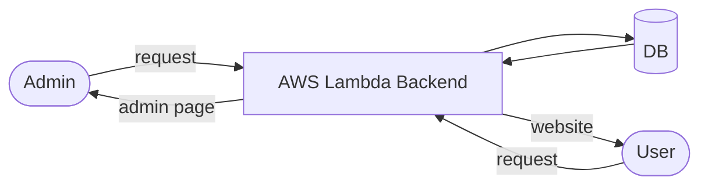

## requirements
### for Users 
 - view opening date/time
 - view news
 - view menu
 - view location

### for Admin
- edit opening date/time
	- date
	- time
	- branch
- edit news
	- title
	- body
- edit menu
- edit branch information
	- name
	- location
- edit admin user
	- name
	- role
	- permissions

## architecture

